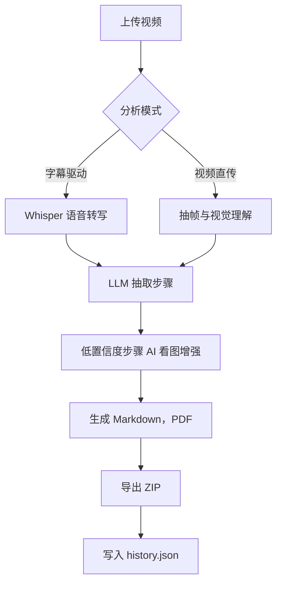

# 🎬 视频转文档 - AI 视频总结工具

将视频自动分析为图文操作文档，输出 `Markdown` 与 `PDF`，支持单视频与批量处理、分片上传与断点续传。  
适合做教程沉淀、操作留档、流程复盘。📝


## ✨ 项目简介

项目由 `Flask` 后端和 `Vue 3 + Vite` 前端组成：

- 后端负责上传、分析、文档生成、下载与历史记录管理
- 前端负责参数配置、上传交互、结果展示与步骤编辑
- 通过 `Whisper + LLM + ffmpeg-python` 完成字幕识别、步骤抽取和截图增强
- 上传链路支持分片续传（前端 `localStorage` + 后端会话文件）

## ✅ 核心功能

- 单视频分析与批量分析（文件列表仅 1 个时自动走单文件流程）
- 字幕驱动模式与视频直传模式
- 低置信度步骤 AI 看图增强
- 结果文档重新生成（支持步骤编辑和排序）
- 历史记录查看、回放与删除
- 导出 Markdown / PDF，支持 ZIP 批量下载
- 分片上传与断点续传（默认 8MB 分片）

## 🔄 工作流程

### 业务流程（用户视角）

1. 上传一个或多个视频文件（支持中断后续传）📤  
2. 配置模型参数（Whisper 模型、视频模式、Web 搜索、FPS 等）⚙️  
3. 发起分析任务，系统逐个处理视频 🤖  
4. 生成步骤化结果，可在线编辑并重新生成文档 ✍️  
5. 下载单个或批量结果（ZIP / Markdown / PDF）📦  
6. 自动写入历史记录，支持后续回看与复用 🗂️  

### 处理流程（系统视角）



## ⬆️ 上传机制（断点续传）

- 前端按分片上传（默认 `8MB`/片），每片独立提交到后端
- 浏览器端用 `localStorage` 记录上传会话 `upload_id`
- 后端将分片会话写入 `uploads/.upload_sessions/`（`.json + .part`）
- 若上传中断，重新选择同一文件会自动续传缺失分片
- 全部分片完成后自动合并为最终视频文件并写入 `uploads/`

## 🧩 技术栈

- 后端：`Python`、`Flask`
- 前端：`Vue 3`、`Vite`
- 多媒体/AI：`Whisper`、`ffmpeg-python`、`imageio-ffmpeg`、`ARK LLM`

## 📁 目录结构

```text
video-toAI-md-pdf-main/
├─ app.py                     # Flask 入口
├─ video_analyzer_agent.py    # 视频分析核心逻辑
├─ requirements.txt           # Python 依赖
├─ package.json               # 前端依赖与脚本
├─ vite.config.js             # Vite 配置（root=static）
├─ templates/
│  └─ index.html              # Flask 模板（自动切换 dev/prod 前端资源）
├─ static/
│  ├─ App.vue                 # Vue 单文件组件
│  ├─ app.js                  # Vite 前端入口
│  ├─ main.css                # 全局样式
│  └─ dist/                   # Vite 构建产物
├─ uploads/                   # 上传目录
│  └─ .upload_sessions/       # 分片续传会话与临时文件
├─ outputs/                   # 输出目录
└─ history.json               # 历史记录
```

## 🚀 快速开始

### 1) 环境要求

- Python `3.8+`（建议 `3.10+`）
- Node.js `18+`（建议 `20+`）
- 可访问 Python 包源（用于安装 `ffmpeg-python` 与 `imageio-ffmpeg`）
- 可用的 `ARK_API_KEY (目前仅支持 doubao-seed-2-0-pro-260215)`

### 2) 安装依赖

```powershell
pip install -r requirements.txt
npm install
```

### 3) 启动方式

#### 开发模式（推荐）

需要两个终端同时运行：

终端 A（前端热更新）：

```powershell
npm run dev -- --host 127.0.0.1 --port 5173 --strictPort
```

终端 B（后端服务）：

```powershell
$env:VITE_DEV_SERVER="http://127.0.0.1:5173"
python app.py
```

访问：`http://127.0.0.1:5000`

#### 生产模式（本地构建后运行）

```powershell
npm run build
Remove-Item Env:VITE_DEV_SERVER -ErrorAction SilentlyContinue
python app.py
```

访问：`http://127.0.0.1:5000`

## 🎞️ ffmpeg 运行机制

- 截图链路优先使用 `ffmpeg-python`
- 程序优先尝试 `imageio-ffmpeg` 提供的 ffmpeg 二进制，并自动注入运行时 PATH
- 若 `imageio-ffmpeg` 不可用，会自动回退到系统 `ffmpeg`
- 若两者都不可用，截图步骤会失败，影响文档图片与部分分析结果

## ❓ 常见问题

### 找不到 `127.0.0.1` 页面

- 确认 `python app.py` 是否正常启动（默认端口 `5000`）
- 开发模式下确认 `npm run dev` 同时运行（默认端口 `5173`）
- 检查访问地址是否为 `http://127.0.0.1:5000`

### 页面空白或前端资源 404

- 开发模式：确认 `VITE_DEV_SERVER` 值与 Vite 端口一致
- 生产模式：确认已执行 `npm run build`，且 `static/dist/app.js` 已生成

### 上传中断后如何继续

- 使用同一浏览器重新选择同一文件即可自动续传
- 若希望从头上传，可清理浏览器 `localStorage` 后重试
- 后端会话文件位于 `uploads/.upload_sessions/`，必要时可手动清理


### `whisper` 或 `ffmpeg` 相关错误

- 先确认安装依赖：`pip install -r requirements.txt`
- 若网络/代理受限，`imageio-ffmpeg` 可能安装失败，此时需安装系统 `ffmpeg` 并加入 `PATH`
- 使用 `whisper --help` 与 `ffmpeg -version` 做基础自检


## 📌 常用命令

```powershell
npm run dev
npm run build
npm run preview
python app.py
```

## ⚠️ 说明

本项目目前主要用于学习与内部验证场景，建议在可控环境中使用。
